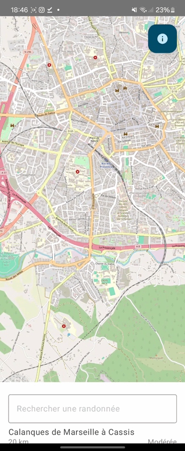

<p>


</p>

#  Rando Planner 



## Table of contents

- [ Rando Planner](#-rando-planner)
  - [Table of contents](#table-of-contents)
  - [Features](#features)
  - [Usage](#usage)
    - [Download our app !](#download-our-app-)

## Features

- Map
- Search in List
- Navigation
- QR Code Scanner
- Vibrator

## Usage 

1. **Clone** this project
```txt
git clone https://github.com/x46x6Cx6F/dev_mobile.git
```
2. *Open* in **Android Studio**

### Download our app !

[Click here](assets/rando_planner.apk) to download an APK.